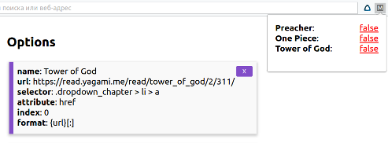

# Media Checker

I'm a big fan of comics, manga and serials, but when they accumulated a lot, it became difficult to follow the release of new series, so I decided to write a program that will do it for me.

Now there is two versions:

* Python3 script
* JavaScript Chrome extension



# Dependencies

Python script needs BeautifulSoup, you can install it with:

```
pip3 install beautifulsoup4
```

# Usage
Extension usage is trivial, just add things to monitor at options page and press enxtension button to check your queries.

Usage from Python is more complex. Here is example of usage with Bash script, that checks for new series in four different sites, so it's easy to adapt for still any site.

```bash
#!/bin/bash

echo -n "New OnePiece: "
./check.py \
    -u "https://mangaclub.ru/manga/view/156-one-piece/v91-c911.html#01" \
    -s ".manga-thumbs-chapters > a" \
    -a "href"

echo -n "New Tower of God: "
./check.py \
    -u "https://read.yagami.me/read/tower_of_god/2/309/" \
    -s ".dropdown_chapter > li > a" \
    -a "href" \
    -i "0"

echo -n "New 100 Bullets: "
./check.py \
    -u "http://unicomics.ru/comics/online/100-bullets-002/" \
    -s "#modal a"\
    -a "href" \
    -i "-2" \
    -f "{url}[10:]"

echo -n "New Preacher: "
./check.py \
    -u "https://www.lostfilm.tv/series/Preacher/seasons/" \
    -s ".beta"\
    -a "innerHTML" \
    -i "1" \
    -f "3 сезон 4 серия"
```

The result of running that script is following:

```
New OnePiece: True
New Tower of God: False
New 100 Bullets: True
New Preacher: False
```

# Flags help

```
usage: check.py [-h] -u URL -s SELECTOR -a ATTRIBUTE [-i INDEX] [-f FORMAT]
                [-d]

optional arguments:
  -h, --help            show this help message and exit
  -u URL, --url URL     Enter URL to comix page with nav element.
  -s SELECTOR, --selector SELECTOR
                        Enter CSS selector to get all nav elements.
  -a ATTRIBUTE, --attribute ATTRIBUTE
                        Enter element's attribute to compare with.
  -i INDEX, --index INDEX
                        Enter element's index to compate with.
  -f FORMAT, --format FORMAT
                        Enter format of string to compare with index-th
                        element, you can use '{url}' with Pythonic slices like
                        '[start:end]'
  -d, --debug           Enables debug mode to see format and comparsions.
```
